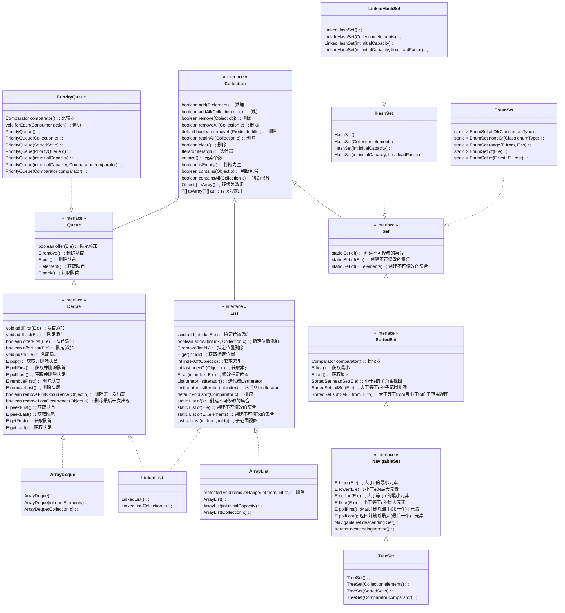
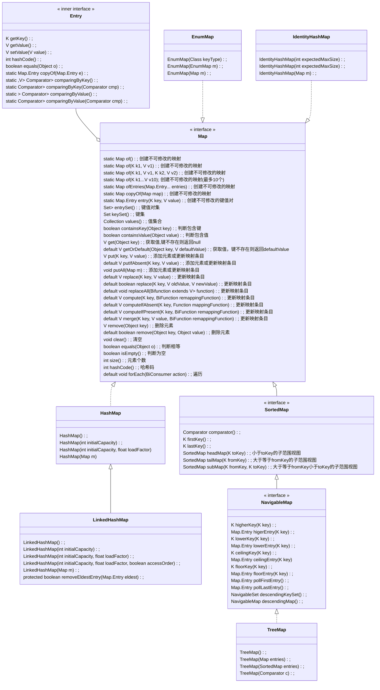

# 集合

java集合在`java.util`包中。集合包括`Collection`和`Map`两种。各自的框架如下图所示。

下面的图中，蓝色框表示接口，紫色框表示抽象类，红色框表示具体类。蓝色实线表示接口间的继承关系，绿色实线表示类之间的继承关系，黄色虚线表示类实现接口。黄色线有两种，浅色的表示实现集合框架内部的接口，深色线表示实现集合框架外部的接口。

## `Collection`接口

### `java.lang.Iterable`接口

`Collection`接口继承了`Iterable`接口，`Iterable`接口定义如下：

```java
public interface Iterable<T>{
    default void forEach(Consumer<? super T> action);
    Iterator<T> iterator();
}
```

1、`forEach`方法的默认实现方式是我们熟悉的一种`for each`循环：

```java
for(T t: this){
    action.accept(t);
}
```

2、`iterator`方法返回一个迭代器`Iterator`对象。

### `java.util.Iterator`接口

`Iterator`接口定义如下，包含四个方法：

```java
public interface Iterator<E>{
    E next();
    boolean hasNext();
    void remove();
    default void forEachRemaining(Consumer<? super E> action);
}
```

1、`hasNext`方法检查迭代器是否还有下一个元素。

2、`next`方法用于逐个访问迭代器的下一个元素。如果到达了迭代器的末尾，`next`方法将抛出`NoSuchElementException`异常。因此，在调用`next`方法之前应当先调用`hasNext`方法检查。

3、`remove`方法用于移除刚刚访问的元素。如果在调用`remove`方法之前没有调用`next`方法，运行时会抛出`IllegalStateException`异常。

4、`forEachRemaining`方法用于遍历元素并逐个操作。

因为java标准类库中的集合类型都实现了`Collection`接口，而`Collection`接口实现了`Iterable`接口，`Iterable`接口的`iterator`方法返回一个迭代器`Iterator`对象。因此，java标准类库中的集合类型都能够获得一个迭代器`Iterator`对象。

#### 遍历迭代器元素的三种方法

遍历迭代器中的元素有三种方法：

```java
Collection<String> c = ...;
// 方法一
for(String element: c){
    // do something with element
}
// 方法二
Iterator<String> iter = c.iterator();
while(it.hasNext()){
    String element = it.next();
    // do something with element
}
// 方法三
iter.forEachRemaining(element -> { // do something with element });
```

#### `ListIterator`接口

`ListIterator`接口继承了`Iterator`接口。

凡是实现了`List`接口的集合都可以获得`ListIterator`迭代器。`List`接口有两个方法可以返回`ListIterator`迭代器：

```java
public interface List<E> extends Collection<E>{
    // 返回Iterator迭代器
    Iterator<E> iterator();
    // 返回ListIterator迭代器
    ListIterator<E> listIterator();
    // 返回的ListIterator迭代器第一个元素为index位置的元素
    ListIterator<E> listIterator(int index);
    ...
}
```

`ListIterator`迭代器新增的方法定义如下：

```java
public interface ListInterator<E> extends Iterator<E>{
    // 返回下一次调用next方法返回的元素的位置索引
    int nextIndex();
    // 检查迭代器之前是否还有元素
    boolean hasPrevious();
    // 返回光标的前一个元素，然后光标向前移动
    E previous();
    // 返回下一次调用previous方法返回的元素的位置索引
    int previousIndex();
    // 在当前光标所指元素的前方（指向下一个元素的方向）插入新元素
    void add(E e);
    // 从列表中移除刚刚利用next或previous方法获得的元素
    void remove();
    // 将刚刚利用next或previous方法获得的元素用e替换
    void set(E e)
}
```

迭代器`ListIterator`光标的起始位置是`first`，`first`指向第一个元素。向前是指从头到尾的方向，向后是指从尾到头的方向。

`next`方法是先移动后返回：光标先向前移动，再返回移动后的光标所指的元素。

`previous`方法是先返回后移动：先返回光标当前所指的元素，再向后移动光标。

`add`方法是在当前光标所指元素的前方（指从头到尾的方向）插入新元素。因此，如果在调用任何`next`或`previous`方法之前（此时光标指向`first`）调用`add`方法，则新添加的元素会成为第一个元素；当迭代器`ListIterator`的`hasNext`方法返回`null`时（此时光标指向最后一个元素）调用`add`方法，则新添加的元素会成为最后一个元素。

`add`方法执行完以后，迭代器`ListIterator`对象已经发生了变化，不能再执行`next`或`previous`方法了，必须重新获取列表的迭代器`ListIterator`。否则会抛出`ConcurrentModificationException`异常。

列表对象的`add`方法和迭代器`ListIterator`的`add`方法不同，是在列表的末尾添加新元素。

```java
public class Test {
    public static void main(String[] args) {
        LinkedList<String> strs = new LinkedList<>();
        strs.add("zhangsan");
        strs.add("lisi");
        strs.add("wangwu");
        ListIterator<String> it = strs.listIterator(); // first
        System.out.println(it.next()); // 移动到zhangsan, 返回zhangsan
        System.out.println(it.next()); // 移动到lisi, 返回lisi
        System.out.println(it.previous()); // 返回lisi, 移动到zhansan
        System.out.println(it.previous()); // 返回zhangsan, 移动到first
        System.out.println(it.next()); // 移动到zhangsan, 返回zhangsan
        it.add("liuliu"); // 指向zhansgan, zhangsan后面添加liuliu
        it = strs.listIterator(); // first
        System.out.println(it.next()); // 移动到zhangsan, 返回zhangsan
        System.out.println(it.next()); // 移动到liuliu, 返回liuliu
        System.out.println(it.next()); // 移动到lisi, 返回lisi
        System.out.println(it.next()); // 移动到wangwu, 返回wangwu
        System.out.println(it.previous()); // 返回wangwu, 移动到lisi
        System.out.println(it.previous()); // 返回lisi, 移动到liuliu
        System.out.println(it.next()); // 移动到lisi, 返回lisi
        System.out.println(it.previous()); // 返回lisi, 移动到liuliu
        /** 输出结果为：
         zhangsan
         lisi
         lisi
         zhangsan
         zhangsan
         zhangsan
         liuliu
         lisi
         wangwu
         wangwu
         lisi
         lisi
         lisi
         */
    }
}
```


### `Collection`接口的实现

`Collection`框架几乎所有的接口和类都位于`java.util`包。

`Collection`接口的框架如下图所示，其中蓝色框代表接口，紫色框代表抽象类，红色框代表具体类：


`Collection`框架的类图如下图所示：



具体类之间的比较如下图所示：

|      类型       |        数据结构        | 有序性 | 可比较性 |  重复性  | 随机访问 | 容量限制(指定容量) | 实现接口                           |
| :-------------: | :--------------------: | :----: | :------: | :------: | :------: | :----------------: | :--------------------------------- |
|   `ArrayList`   |          数组          |  有序  | 不可比较 |  可重复  |    可    |       无限制       | `List`                             |
|  `LinkedList`   |  双向链表（双向队列）  |  有序  | 不可比较 |  可重复  |   不可   |       无限制       | `List`、`Deque`->`Queue`           |
|  `ArrayDeque`   |  循环数组（双向队列）  |  有序  | 不可比较 |  可重复  |   不可   |   有限制(默认16)   | `Deque`->`Queue`                   |
| `PriorityQueue` |   最小堆（优先队列）   |  无序  |  可比较  |  可重复  |   不可   |   有限制(默认11)   | `Queue`                            |
|    `TreeSet`    |         红黑树         |  有序  |  可比较  | 不可重复 |   不可   |       无限制       | `NavigableSet`->`SortedSet`->`Set` |
|    `HashSet`    |   链表数组（散列表）   |  无序  | 不可比较 | 不可重复 |   不可   | 无限制(默认16个桶) | `Set`                              |
| `LinkedHashSet` | 链表数组（链接散列表） |  有序  | 不可比较 | 不可重复 |   不可   | 无限制(默认16个桶) | `Set`                              |
|    `EnumSet`    |         位序列         |  有序  |  可比较  | 不可重复 |    可    |       无限制       | `Set`                              |


#### `Collection`接口

`Collection`接口有几个方法需要注意：

（1）当调用`Object[] toArray()`（无参数）方法时，会用`new`运算符创建一个实际类型为`Object[]`（而不是`T[]`）的对象数组，并返回它。因此只能用`Object[]`类型的对象变量接收该方法返回的对象数组，并且无法进行强制类型转换为`T[]`。

（2）因此一般都是使用`<T> T[] toArray(T[] a)`（有参数）方法，用一个已知的`a`对象数组去接收。如果`a`足够大（容量大于等于集合容量），则用集合中的元素填充，剩余空间填充`null`；否则为`a`重新分配一个元素类型为`T`、容量与集合容量相同的数组，填充集合元素。

（3）`boolean removeAll(Collection<?> c)`方法会删除集合中"出现在`c`中的重复元素"；`boolean retainAll(Collection<?> c)`则正好相反，会删除"未出现在`c`中的元素"。

（4）`Iterator iterator()`方法返回一个`Iterator`迭代器。

继承`Collection`接口的子接口分为三种：（1）`List`；（2）队列`Queue`；（3）集`Set`。

#### `List`接口

1、`List`接口代表有序集合，元素可以重复，元素之间不可比较。有序的含义是：元素的遍历顺序等于它们的插入顺序。

2、有序集合有两种实现方式：

（1）数组：各元素是连续存储的。所以可以按迭代器顺序访问，也可以按索引位置随机访问。但是插入和删除元素开销很大，因为删除一个元素后，该元素之后的所有元素都要向前移动；插入一个元素后，该元素之后的所有元素都要向后移动。对应`ArrayList`类，其内部封装了一个动态再分配的对象数组`Object[]`。

（2）双向链表：各元素不是连续存储的，但是前一个结点保存了上一个节点和下一个节点的地址。所以双向链表只能按迭代器顺序访问，但是其插入和删除操作非常迅速。对应`LinkedList`类。

3、`List`接口定义了多个按索引位置访问的方法。`ArrayList`和`LinkedList`都实现了这些方法，但是它们各自的实现有差异：

（1）`ArrayList`类的随机访问是通过实现`RandomAccess`接口实现的（但实际上`RandomAccess`未定义任何方法，只是一个标记接口）。只有`ArrayList`实现了`RandomAccess`接口，即只有`ArrayList`可以随机访问。

（2）`LinkedList`中按索引位置访问的方法内部仍然是按迭代顺序逐元素访问的，例如`E get(int index)`方法（尽管后来做了一些改进：如果`index > length / 2`，则从尾到头开始遍历）。由于`LinkedList`是双向链表，所以它也是双向队列的一种实现（实现了`Deque`接口）。

#### `Queue`接口

1、`Queue`接口代表普通队列，其子接口`Deque`代表双向队列。java中没有普通队列的实现类，都是双向队列的实现类。

（1）双向队列遵循"先进先出"的原则，并且更进一步：在队头和队尾都可以添加或删除元素，可以删除中间元素，不能获取中间元素，不能在中间添加元素。

（2）双向队列按照其抽象作用来说，不能删除中间原则（删除中间元素没有意义，破坏了先进先出原则）。但是因为`Collection`接口定义了这个方法，所以实现`Queue`接口的具体类必须实现这个方法。

2、双向队列有两种实现方式：

（1）双向链表，对应`LinkedList`类。虽然双向队列不能获取中间元素也不能在中间添加元素，但是`LinkedList`同时也是有序列表的一种实现（实现了`List`接口），所以它能够获取中间元素，也能够在中间添加元素，甚至可以按索引位置进行以上操作（尽管不是随机访问）。

（2）循环数组，对应`ArrayDeque`类。`ArrayDeque`虽然是数组，但是被限制为双向队列类型了，所以就无法获取中间元素，在中间添加元素了，因此可以认为`ArrayDeque`实际上是被限制版本的`ArrayList`。

3、普通队列的一种特殊实现是优先队列`PriorityQueue`。

（1）`PriorityQueue`对应的数据结构是最小堆，最小堆的特性是每次的`add`和`remove`方法都可以让最小的元素移动到根。因此每次删除元素时总是会删除最小的元素。

（2）但是最小堆并不是队列，导致`PriorityQueue`实际上没有队首和队尾的概念，所以`PriorityQueue`是无序的：每次添加元素时不会将元素按大小顺序添加至合适的位置；遍历元素时也不会按照添加顺序遍历；只有删除元素时总是删除最小的元素。

（3）为了删除最小元素，`PriorityQueue`中的元素首先要能够进行比较，可以用两种方法实现这个要求：（1）元素本身是实现了`Comparable`接口的类型；（2）为`PriorityQueue`绑定一个比较器`Comparator`对象。

（4）因为上述这些特性，`PriorityQueue`的典型用法是任务调度。每个任务都有一个优先级数字，数字越小代表优先级越高，每当启动一个新任务时就会从队列中挑选（删除）优先级最高的任务启动。

#### `Set`接口

1、`Set`接口代表无重复元素的集。

（1）`SortedSet`接口继承了`Set`接口，提供了用于排序的比较器对象，定义了可以得到集合子集视图的方法。`NavigableSet`接口继承了`SortedSet`接口，功能更进一步。树集`TreeSet`实现了`NevigableSet`接口。

（2）哈希散列集`HashSet`则直接实现了`Set`接口。

这两个类都重写了`add`方法，不允许添加重复元素。

2、`TreeSet`的数据结构是红黑树。

（1）红黑树的特性是：每次将一个元素添加到树中时，都会将其放置在正确的排序位置上。因此`TreeSet`是元素间可比较的、有序的、无重复的散列集。要实现元素间可比较性，就要求：（1）元素是实现了`Comparable`接口的类型；（2）为`TreeSet`绑定一个比较器`Comparator<E>`。

（2）与`HashSet`相比，`TreeSet`的插入和删除操作很复杂，较慢；但是查询操作很快，因为`HashSet`的查询次数取决于桶数，而`TreeSet`的查询次数最坏情况下也是$log_2{n}$（$n$是元素个数）。

（3）因为`TreeSet`是有序且可比较的，所以还能够返回一个元素按降序排列的迭代器`Iterator`。

3、`HashSet`的数据结构是散列表（链表数组）。

（1）当添加或删除一个元素时，首先计算元素所在桶的索引，然后对桶（链表）进行添加或删除操作，因此插入和删除操作都比较高效。查询次数取决于桶数。

（2）但是，`HashSet`不像有序列表`List`一样顺序存储元素，也不像队列`Queque`一样有队首和队尾的位置概念，还不能像优先队列`PriorityQueue`或`TreeSet`一样进行比较以获取最小最大元素，所以它只能通过遍历迭代器来按顺序访问元素。遍历顺序不一定等于插入顺序，这是因为元素插入的桶的索引是随机的，但遍历是按桶的顺序依次遍历的（同一个桶中的元素是有序的）。

（3）因为`HashSet`是无序的，所以`equals`方法被重新定义：只要两个集中的元素都相同，尽管顺序不同，仍然判定为相等。只要两个集相等，`hasCode`方法就会返回相同的散列码。

4、散列表

`HashSet`对应的数据结构是由链表数组实现的散列表（如下图所示）。

（1）散列表的每个数组元素是一个链表，这个链表被称为桶。每个元素所在的桶的索引 = 元素的散列码对桶的总数取余。 

（2）元素的散列码由散列函数（`hashCode()`方法）获得，不同类型的元素会有不同的实现。

（3）桶数可以被预先指定。标准类库使用的默认桶数是16。


**散列冲突**

（1）当向散列表中插入一个新元素时：（1）首先计算它应该插入的位置，即所在的桶的索引；（2）然后插入桶中，但是桶中可能已经有元素了，这种现象就是==散列冲突==（（桶未必满了，只要有元素就会造成散列冲突）。

（2）当造成散列冲突（一般是由于散列函数选择不好）时，就需要将新插入元素与桶中元素一一比较，以确定这个元素是否已经存在于桶中。如果存在，就不用再添加了。

（3）在java 8以后，桶满时，会将链表数组（`HashSet`实现）转变为==平衡二叉树（`TreeSet`实现）==。

**再散列**

如果散列表太满（一般是由于桶数不够），就需要进行==再散列==：创建一个桶数更多（一般为原来桶数的2倍）的表，并将所有元素插入到新表中，丢弃原来的表。装填因子（一般为0.75）可以确定何时对散列表进行再散列。

5、链接哈希集`LinkedHashSet`是`HashSet`的加强版：有序的`HashSet`。它的数据结构仍然是链表数组（链接散列表：散列表+链表），其中散列表的功能和`HashSet`一样，链表的功能是记录了元素的插入顺序：但是每个链表节点上增加了两个记录：在该节点之前插入的节点地址和在该节点之后插入的节点地址。这两个记录确保了`LinkedHashSet`的有序性：遍历顺序就是插入顺序。


6、枚举集`EnumSet`中的元素是枚举类型。

由于枚举类型只有有限个实例，所以`EnumSet`内部用位序列实现。如果对应的值在集中，则相应的位被置为1。

`EnumSet`类没有公共的构造器，要使用静态工厂方法构造这个集。


## `Map`接口

`SortedMap`接口提供了用于排序的比较器对象，定义了可以得到集合子集视图的方法。

`NavigableMap`接口包含一些用于搜索和遍历映射的方法。`TreeMap`类实现了`NavigableMap`接口。


1、映射`Map`类型的元素是由键值对组成的。根据键的顺序来组织元素，键是不能重复的，所以映射`Map`和集`Set`类似：

（1）实现`Set`接口的具体类有`HashSet`（`LinkedHashSet`）、`TreeSet`、`EnumSet`；实现`Map`接口的具体类有`HashMap`（`LinkedHashMap`）、`TreeMap`、`EnumMap`，另外还新增了对应`HashMap`的两种特殊类`WeakHashMap`和`IdentityHashMap`。

（2）`HashSet`和`TreeSet`分别根据元素的散列函数（`hashCode()`）或比较器（`Comparator`）来组织元素；同样的，`HashMap`和`TreeMap`分别根据元素的键的散列函数（`hashCode()`）或比较器（`Comparator`）来组织元素。

2、类似于`LinkedHashSet`和`HashSet`的关系，链接哈希映射`LinkedHashMap`也是`HashMap`的加强版：键有序的`HashMap`。其数据结构仍然是链表数组（散列表+链表）。其散列表功能与`HashMap`一样，但其链表功能用于记录插入顺序。

（1）与`LinkedHashSet`相比，`HashMap`不仅可以实现按插入顺序遍历元素，还可以按访问顺序遍历元素，只要将构造器`LinkedHashMap(int initialCapacity, float loadFactor, boolean accessOrder)`的参数`accessOrder`设置为`true`即可。这样，每次访问某个元素后（调用`get`、`put`、`compute`、`replace`等方法时，具体细节参考java API）都会将该元素置于链表末尾（不改变元素在散列表中的位置，仅改变在链表中的位置）。因此，链表最前面的元素是"最近最少访问"的元素。这一功能非常适合构建LRU缓存。

（2）另外，`LinkedHashMap`还提供了一个方法`protected boolean removeEldestEntry(Map.Entry<K, V> eldest)`：每次添加一个新的映射条目时，就会调用该方法，如果方法返回`true`（默认返回`false`），就会删除预期的`eldest`元素（最近最少访问的元素，即链表最前面的元素）。可以利用创建`LinkedHashMap`匿名子类对象的方式重写该方法：

```java
var cache = new LinkedHashMap<K, V>(128, 0.75, true){
    protected boolean removeEldestEntry(Map.Entry<K, V> eldest){
        ...
    }
};
```


3、枚举映射`EnumMap`和`EnumSet`类似，元素的键是枚举类型。

4、标识散列映射`IdentityHashMap`和`HashMap`的主要区别在于：

（1）键的散列值不是由`hashCode`函数计算的，而是用`System.identityHashCode()`方法计算的，这是`Object`类的`hashCode()`方法中调用的方法：根据对象的内存地址计算散列码。

（2）另外，在对两个键进行比较时，`IdentityHashMap`类使用`==`比较，而不是`equals()`方法进行比较。例如：在`V get(K key)`方法中，会将指定的`key`与所有元素的键进行比较。`equals(Object o)`方法允许两个键引用不同，只要内容相同也可判断为相等；但是`==`要求引用相等（即引用同一个对象，故内容肯定相等），条件更严格。

在实现对象遍历算法（如对象串行化）时，这个类非常有用，可以用来跟踪哪些对象已经遍历过。





```java
/**
如果键不存在,则添加元素(key, value);否则更新值为value
*/
V put(K key, V value);
/**
针对m中的每个元素:调用put方法
*/
void putAll(Map<? extends K, ? extends V> m);
/**
如果键不存在或旧值为null,则更新值为value并返回value;否则不改变并返回旧值
*/
default V putIfAbsent(K key, V value){
    V v = map.get(key);
    if (v == null)
        v = map.put(key, value);
    return v;
}
/**
该方法要求键必须存在
将方法引用到键和旧值以计算新值
如果新值也为null,则删除元素并返回null;否则更新值为新值并返回新值
*/
default V compute(K key, BiFunction<? super K,? super V,? extends V> remappingFunction){
    V oldValue = map.get(key);
     V newValue = remappingFunction.apply(key, oldValue);
     if (newValue != null) {
         map.put(key, newValue);
     } else if (oldValue != null || map.containsKey(key)) {
         map.remove(key);
     }
     return newValue;
}
/**
如果键不存在或旧值为null,则不改变并返回null
如果键存在且旧值不为null,则将方法应用到键和旧值以计算新值
如果新值为null,则删除元素并返回null;否则更新值为新值并返回新值
*/
default V computeIfPresent(K key, BiFunction<? super K,? super V,? extends V> remappingFunction){
    if ((V oldValue = map.get(key)) != null) {
     	V newValue = remappingFunction.apply(key, oldValue);
     	if (newValue != null)
         	map.put(key, newValue);
     	else
         	map.remove(key);
    }
    return map.get(key);
}
/**
如果键存在且旧值不为null,则不改变并返回旧值
如果键不存在或旧值为null,则将方法应用到键以计算新值
如果新值为null则不改变并返回旧值;否则更新值为新值并返回新值
*/
default V computeIfAbsent(K key, Function<? super K,? extends V> mappingFunction){
    if (map.get(key) == null) {
        V newValue = mappingFunction.apply(key);
        if (newValue != null)
            map.put(key, newValue);
    }
    return map.get(key);
}
/**
如果键存在则更新值为value并返回value,否则不改变并返回null
*/
default V replace(K key, V value){
    if (map.containsKey(key)) {
        return map.put(key, value);
    } 
    else{
        return null;
    }
}
/**
如果键存在且旧值为oldValue,则更新值为newValue并返回true;否则不改变并返回false
*/
default boolean replace(K key, V oldValue, V newValue){
    if (map.containsKey(key) && Objects.equals(map.get(key), oldValue)) {
        map.put(key, newValue);
        return true;
    }
    else{
        return false;
    }
}
/**
针对所有存在的键:将方法应用到键和旧值上以计算新值,将值更新为新值
*/
default void replaceAll(BiFunction<? super K, ? super V, ? extends V> function){
     for (Map.Entry<K, V> entry : map.entrySet()){
         entry.setValue(function.apply(entry.getKey(), entry.getValue()));
     }
}
/** 
键不存在或旧值为null,则新值为value
健存在且旧值不为null,则将方法应用到旧值和value上以计算新值
如果新值也为null,则删除元素并返回null;否则更新值为新值并返回新值
*/
default V merge(K key, V value, BiFunction<? super V, ? super V, ? extends V> remappingFunction){
    V oldValue = map.get(key);
 	V newValue = (oldValue == null) ? value : remappingFunction.apply(oldValue, value);
     if (newValue == null)
         map.remove(key);
     else
         map.put(key, newValue);
    return map.get(key);
}
/**
如果键存在则删除元素并返回旧值;否则不改变并返回null
*/
V remove(Object key);
/**
如果键存在且旧值为value,则删除元素并返回true;否则返回false
*/
default boolean remove(Object key, Object value){
    if (map.containsKey(key) && Objects.equals(map.get(key), value)) {
        map.remove(key);
        return true;
    } 
    else{
        return false;
    }
}
```


## 视图(view)

### `Map`对象的映射视图

`Map`有三种方法可以获取视图：（1）`Set<K> keySet()`方法获取键集视图；（2）`Collection<V> values()`方法获取值集合视图；（3）`Set<Map.Entry<K, V>> entrySet()`方法获取键值对集视图。

2、对返回的视图对象的操作是有限制的：

（1）`Set<K> keySet()`方法返回的键集视图：可以删除键（结果是会删除整个元素）；不能添加键（抛出`UnsupportedOperationException`异常）；可以修改键（（因为例如`forEach`等方法都是按值引用，所以只能修改对象的状态，不能修改引用，没有支持直接更改引用的方法）。

（2）`Collection<V> values()`方法返回的值集合视图：可以删除值（结果是会删除整个元素）；不能删除值（抛出`UnsupportedOperationException`异常）；可以修改值（因为例如`forEach`等方法都是按值引用，所以只能修改对象的状态，不能修改引用，没有支持直接更改引用的方法）。

（3）`Set<Map.Entry<K, V>> entrySet()`方法获取的键值对集视图：可以删除元素；不能添加元素（抛出`UnsupportedOperationException`异常尽管添加键值对不像仅添加键或值一样听起来没道理）；可以修改元素（例如`setValue`方法重新映射，可以直接更改值的引用）。

```java
public class Test {
    public static void main(String[] args) {
        HashMap<A, A> map = new HashMap<>();
        map.put(new A(1), new A(2));
        Set<A> keys = map.keySet();
        Collection<A> values = map.values();
        var entries = map.entrySet();
        keys.forEach(k->{
            // 只能修改对象的状态,无法更改引用(改了不生效)
            k.x = 3;
        });
        values.forEach(v->{
            // 只能修改对象的状态,无法更改引用(改了不生效)
            v.x = 4;
        });
        map.forEach((k, v)->{
            System.out.println(k.x);
            System.out.println(v.x);
        });
        entries.forEach(e->{
            // 可以直接更改值的引用
            e.setValue(new A(6));
        });
        map.forEach((k, v)->{
            System.out.println(k.x);
            System.out.println(v.x);
        });
    }
}
class A{
    public int x;
    public A(int x){
        this.x = x;
    }
}
/** 输出结果为：
3
4
3
6
*/
```

3、其实现原理是：

在具体类内部，定义了一系列的成员内部类，这些类实现了相应的`Collection`、`Set`接口。

执行这些方法时，会创建这些内部类对象。内部类对象本身不存储任何字段，它引用的是`Map`对象。

内部类中重写了很多方法，方法内会访问引用的`Map`对象成员，因此操作视图对象就相当于操作`Map`对象。

但是内部类中没有重写`add`方法（继承的抽象类的`add`方法会抛出异常）。


4、我们以`HashMap`类的`Set<K> keySet()`方法为例进行说明（其他两个方法类似）：

第一次调用`HashMap`对象的`Set<K> keySet()`方法时：实例字段`keySet`是`null`，此时会执行`ks = new KeySet()`语句创建一个`KeySet`类对象并赋值给`ks`，方法最终返回的是键集视图对象`ks`。

（1）因为`KeySet`类是`HashMap`类的成员内部类，所以在创建`KeySet`类对象时隐式地引用了当前`HashMap`对象，这意味着这个`KeySet`对象可以在`KeySet`类方法中访问引用的`HashMap`对象的任意成员。

（2）在调用`ks`的方法时，在方法内部，实际上会访问对象`ks`隐式引用的`HashMap`对象的成员，并对它们进行操作。因此，虽然视图对象`ks`没有存储任何字段（`KeySet`类没有定义任何字段，构造器也是默认的），但是我们对它的操作实际上就是对`HashMap`对象的操作。

（3）又因为`ks`实际引用的对象上是`KeySet`类型，它被解释成了`Set`类型，所以我们只能调用`Set`类中定义的方法；不能调用`HashSet`等具体类的方法。

（4）在我们可以调用的方法中：例如`remove`方法，可以删除一个键；但是利用`add`方法添加一个键时却会抛出一个`UnsupportedOperationException`异常。这是因为：`KeySet`类重写了`remove(E e)`方法，会删除其引用的`HashMap`对象的元素；但是`KeySet`类及其超类`AbstractSet`内部都没有重写`add(E e)`方法，但是超类`AbstractCollection`定义了`add(E e)`方法：什么也不执行，只抛出一个`UnsupportedOperationException`异常。

https://stackoverflow.com/questions/51435587/how-can-hashmap-keyset-return-a-view-of-keys


```java
public class HashMap<K,V> extends AbstractMap<K,V> implements Map<K,V>, Cloneable, Serializable {
    ...
    transient Set<K> keySet;
    public Set<K> keySet() {
        Set<K> ks = keySet;
        if (ks == null) {
            ks = new KeySet();
            keySet = ks;
        }
        return ks;
    }
    final class KeySet extends AbstractSet<K> {
        public final int size() { return size; }
        public final void clear() { HashMap.this.clear(); }
        public final Iterator<K> iterator() { return new KeyIterator(); }
        public final boolean contains(Object o) { return containsKey(o); }
        public final boolean remove(Object key) { return removeNode(hash(key), key, null, false, true) != null; }
        public final Spliterator<K> spliterator() { return new KeySpliterator<>(HashMap.this, 0, -1, 0, 0); }
        public Object[] toArray() { return keysToArray(new Object[size]); }
        public <T> T[] toArray(T[] a) { return keysToArray(prepareArray(a)); }
        public final void forEach(Consumer<? super K> action) {
            Node<K,V>[] tab;
            if (action == null)
                throw new NullPointerException();
            if (size > 0 && (tab = table) != null) {
                int mc = modCount;
                for (Node<K,V> e : tab) {
                    for (; e != null; e = e.next)
                        action.accept(e.key);
                }
                if (modCount != mc)
                    throw new ConcurrentModificationException();
            }
        }
    }
}
public abstract class AbstractSet<E> extends AbstractCollection<E> implements Set<E>{
    // 没有重写add方法
}
public abstract class AbstractCollection<E> implements Collection<E> {
    public boolean add(E e) {
        throw new UnsupportedOperationException();
    }
}
```


### 静态方法创建不可修改的集合视图

1、`List`、`Set`、`Map`接口定义了一系列`of`方法，用于创建不可修改的集合与映射。

这些集合或映射"不可修改"的意思是：可以修改对象的状态，但不能修改引用。

之所以不能修改引用，是因为：（1）`Set`和`List`类型没有直接修改引用的更改器方法，因为具体的类型是这些接口的子类，相关的方法都会抛出`UnsupportedOperationException`异常；（2）`Set`、`List`、`Map`类型都设置返回的对象为`final`类型，即使`Map`类型有更改器方法，也会受到限制，不允许更改对象引用。

```java
public class Test {
    public static void main(String[] args) {
        List<A> ls = List.of(new A(1));
        ls.forEach(a->{
            a.x = 2;
        });
        ls.forEach(a->{
            System.out.println(a.x); // 2
        });
        ls.forEach(a->{
            a = new A(3);
        });
        ls.forEach(a->{
            System.out.println(a.x); // 2
        });
        A key = new A(1);
        A value = new A(2);
        Map<A, A> map = Map.of(key, value);
        map.forEach((k, v)->{
            k.x = 3;
            v.x = 4;
        });
        map.forEach((k, v)->{
            System.out.println(k.x); // 3
            System.out.println(v.x); // 4
        });
        map.forEach((k, v)->{
            k = new A(5);
            v = new A(6);
        });
        map.forEach((k, v)->{
            System.out.println(k.x); // 3
            System.out.println(v.x); // 4
        });
         // 抛出UnsupportedOperationException异常
        map.put(key, new A(7));
        map.forEach((k, v)->{
            System.out.println(v.x);
        });
    }
}
class A{
    public int x = 3;
    public A(int x){
        this.x = x;
    }
}
```

2、实在要更改，只能重新创建集合或映射，将这个不可修改的集合或映射传递到构造器：

```java
var ls2 = new ArrayList(List.of(new A(1)));
var map2 = new HashMap(Map.of(key, value));
```

3、其实现原理是：

在具体类内部，定义了一系列的静态内部类，这些类实现了相应的`List`、`Set`、`Map`接口。

执行`of`方法时，会创建这些内部类对象。

这些对象的元素都是`final`类型的字段，因此无法更改其引用。

并且内部类中没有重写更改器方法（继承的抽象类的更改器方法会抛出异常）。


### 集合或映射的子范围视图

1、`List`、`SortedSet`、`SortedMap`定义了一系列获取子范围视图的方法：

```java
public interface List<E> extends Collection<E> {
    List<E> subList(int from, int to);
    ...
}
public interface SortedSet<E> extends Set<E> {
    SortedSet<E> headSet(E e);
	SortedSet<E> tailSet(E e); 
	SortedSet<E> subSet(E from, E to); 
    ...
}
public interface SortedMap<K,V> extends Map<K,V> {
    SortedMap<K,V> headMap(K toKey); 
	SortedMap<K,V> tailMap(K fromKey); 
	SortedMap<K,V> subMap(K fromKey, K toKey); 
    ...
}
```

2、对视图对象可以进行任意操作，操作效果会全部反映到实际对象中，就相当于对集合或映射对象本身进行操作，只是范围有限制。

3、其实现原理是：

在具体类内部，定义了一系列的静态内部类，这些类实现了相应的`List`、`Set`、`Map`接口。

执行这些方法时，会创建这些内部类对象。

这些对象的实例字段引用了实际的集合或映射对象，但是增加了一些有关范围的字段。

内部类重写了许多方法，使得在访问和操作元素时只能获取到范围内的元素。

### `Collections`类创建不可修改的视图

1、`Collections`类有8个方法获得不可修改的视图：

```java
public class Collections extends Object{
    static <T> Collection<T> unmodifiableCollection(Collection<? extends T> c);
    static <T> List<T> unmodifiableList(List<? extends T> list); 
    static <T> Set<T> unmodifiableSet(Set<? extends T> s);
    static <T> SortedSet<T> unmodifiableSortedSet(SortedSet<T> s);
    static <T> NavigableSet<T> unmodifiableNavigableSet(NavigableSet<T> s);
    static <K,V> Map<K,V> unmodifiableMap(Map<? extends K,? extends V> m);
    static <K,V> SortedMap<K,V> unmodifiableSortedMap(SortedMap<K,? extends V> m);
    static <K,V> NavigableMap<K,V> unmodifiableNavigableMap(NavigableMap<K,? extends V> m);
}
```

2、"不可修改"的含义是：可以修改对象（元素、键、值）的状态，但不能修改引用。

3、其实现原理是：

在`Collections`类内部，定义了一系列的静态内部类，这些类实现了相应的`List`、`Set`、`Map`接口。

执行这些方法时，会创建这些内部类对象。

这些对象的实例字段引用了实际的集合或映射对象，但是这个实例字段是`final`的，因此不可更改引用。

另外，在内部类重写了许多更改器方法，这些更改器方法会直接抛出`UnsupportedOperationException`异常。

### 检查型视图

1、`Collections`类有9个方法获得检查型视图：

```java
public class Collections extends Object{
	static <E> Collection<E> checkedCollection(Collection<E> c, Class<E> type);
    static <E> List<E> checkedList(List<E> list, Class<E> type);
    static <E> Queue<E> checkedQueue(Queue<E> queue, Class<E> type);
    static <K,V> Map<K,V> checkedMap(Map<K,V> m, Class<K> keyType, Class<V> valueType);
    static <K,V> SortedMap<K,V> checkedSortedMap(SortedMap<K,V> m, Class<K> keyType, Class<V> valueType);
    static <K,V> NavigableMap<K,V> checkedNavigableMap(NavigableMap<K,V> m, Class<K> keyType, Class<V> valueType);
    static <E> Set<E> checkedSet(Set<E> s, Class<E> type);
    static <E> SortedSet<E> checkedSortedSet(SortedSet<E> s, Class<E> type);
    static <E> NavigableSet<E> checkedNavigableSet(NavigableSet<E> s, Class<E> type);
}
```

2、检查型视图可以进行添加、删除、修改、访问等任何操作，最终都会反映到具体的集合或映射对象上。但是在添加新元素时，增加了类型检查，主要是为了避免类似以下的这种情况：

```java
var strings = new ArrayList<String>();
ArrayList rawList = string;
rawList.add(new Date()); // 编译通过,运行时检测不到
var safeStrings = Collections.checkedList(new ArrayList<String>());
ArrayList safeList = safeStrings;
safeList.add(new Date()); // 编译通过,运行时报错
```

主要还是解决遗留代码中泛型`A`而非泛型`A<E>`的问题。实际上，在高版本的java中，只要代码规范，就基本不用担心类型不匹配的问题，因为编译器有足够的能力检测出来。

3、其实现原理是：

在`Collections`类内部，定义了一系列的静态内部类，这些类实现了相应的`List`、`Queue`、`Set`、`Map`接口。

执行这些方法时，会创建这些内部类对象。

这些对象的实例字段引用了实际的集合或映射对象，但是这个实例字段是`final`的，因此不可更改引用。

另外，在内部类重写的许多方法实际都是调用超类的方法，但是添加新元素的`add`方法增加了类型i检查的步骤。

### 同步视图

1、`Collections`类有8个获得同步视图的方法：

```java
public class Collections extends Object{
	static <T> Collection<T> synchronizedCollection(Collection<T> c);
    static <T> List<T> synchronizedList(List<T> list);
    static <T> Set<T> synchronizedSet(Set<T> s);
    static <T> SortedSet<T> synchronizedSortedSet(SortedSet<T> s)
    static <T> NavigableSet<T> synchronizedNavigableSet(NavigableSet<T> s);
    static <K,V> Map<K,V> synchronizedMap(Map<K,V> m);
    static <K,V> SortedMap<K,V> synchronizedSortedMap(SortedMap<K,V> m);
    static <K,V> NavigableMap<K,V> synchronizedNavigableMap(NavigableMap<K,V> m);
}
```

2、同步视图可以进行添加、删除、修改、访问等任何操作，最终都会反映到具体的集合或映射对象上。同步视图是为了解决多线程同步访问问题的。

3、其实现原理是：

在`Collections`类内部，定义了一系列的静态内部类，这些类实现了相应的`List`、`Set`、`Map`接口。

执行这些方法时，会创建这些内部类对象。

这些对象的实例字段引用了实际的集合或映射对象，但是这个实例字段是`final`的，因此不可更改引用。

另外，在内部类重写的许多方法实际都是调用超类的方法，但是将其设置为了同步方法。

## 遗留集合

1、`Enumeration`（枚举）接口：与`List`接口相似，都是按顺序遍历元素的接口，只不过定义的方法很少。

```java
public interface Enumeration<E>{
    default Iterator<E> asIterator();
    boolean hasMoreElements();
    E nextElement();
}
```

（1）对于实现了`Enumeration`接口的类，可以使用`Collections.list`方法将元素收集到一个`ArrayList`中。

（2）对于任何实现了`Collection`接口的类，可以使用`Collections.enumeration`方法将元素收集到一个`Enumeration`中。

```java
public class Collections extends Object{
    static <T> ArrayList<T> list(Enumeration<T> e);
    static <T> Enumeration<T> enumeration(Collection<T> c);
    ...
}
```


2、`Vector`类：与`ArrayList`类作用一样，但是是同步的`ArrayList`。`Vector`类也继承了`AbstractList`类，实现了`List`、`RandomAccess`、`Cloneable`、`Serializable`接口。

3、`Stack`（栈）类：由于`Stack`类继承了`Vector`类，所以也拥有在中间插入或删除元素的`insert`和`remove`方法，这不符合栈的规则，应尽量避免使用。

```java
public class Stack<E> extends Vector<E> {
    boolean empty();
    E peek();
    E pop();
    E push();
    int search(Object o);
}
```


4、`HashTable`（哈希表）类：与`HashMap`类作用一样，接口也基本相同；并且`HashTable`和`Vector`一样都是同步的。

5、`Properties`（属性映射）类：是一个特殊的映射结构，拥有以下特性：

（1）其键与值都是字符串：由于`Properties`继承了`HashTable<Object, Object>`类，所有也拥有`put`等方法，但这些方法允许插入或更新非`String`类型的键或值，因此强烈不建议，建议只使用`setProperty(String key, String value)`方法更改属性。

（2）可以保存到文件或从文件加载：利用一系列`load`和`store`方法。

（3）有一个二级表存放默认值：在构造器中传入另外一个`Properties`对象作为二级表，当使用`get`方法找不到指定键时则去查找二级表。

```java
public class Properties extends Hashtable<Object,Object> {
    Properties();
    Properties(int initialCapacity);
    Properties(Properties defaults);
    String getProperty(String key);
    String getProperty(String key, String defaultValue);
    void load(InputStream inStream);
    void load(Reader reader);
    void loadFromXML(InputStream in);
    void store(OutputStream out, String comments);
    void store(Writer writer, String comments);
    void storeToXML(OutputStream os, String comment);
    void storeToXML(OutputStream os, String comment, String encoding);
    void storeToXML(OutputStream os, String comment, Charset charset);
    Object setProperty(String key, String value);
    Set<String> stringPropertyNames();
    Enumeration<?> propertyNames();
    void list(PrintStream out);
    void list(PrintWriter out);
}
```

属性映射对于指定程序的配置选项很有用。但是，`Properties`类没有层次结构，如果想要配置复杂的有层次结构的信息，就应该改为使用`Preferences`类。

例如，我们可以利用`java.lang.System`类的静态方法获取或设置系统属性：

```java
public final class System extends Object {
    static final PrintStream err;
    static final InputStream in;
    static final PrintStream out;
	static Properties getProperties();
    static String getProperty(String key);
    static void setProperties(Properties props);
    static String setProperty(String key, String value);
    ...
}
```


6、`BitSet`（位集）类：用于存储一个位序列。它将位包装在字节里，所以使用位集要比使用`Boolean`对象的`ArrayList`高效很多。

位集一般用于存储标志。

```java
public class BitSet extends Object implements Cloneable, Serializable{
    BitSet();
    BitSet(int nbits);
    void clear();
    void clear(int bitIndex);
    void clear(int fromIndex, int toIndex);
    int length();
    boolean get(int bit);
    void set(int bit);
    void clear(int bit);
    void and(BitSet set);
    void or(BitSet set);
    void xor(BitSet set);
    void andNot(BitSet set);
}
```


## 集合的简单算法

以下是`Collections`类中的一些方法，这些方法都实现了一些基本算法。

```java
public class Collections extends Object{
    /** 最大最小元素 */
    static <T extends Object & Comparable<? super T>> T max(Collection<? extends T> coll);
    static <T> T max(Collection<? extends T> coll, Comparator<? super T> comp);
    static <T extends Object & Comparable<? super T>> T min(Collection<? extends T> coll);
    static <T> T min(Collection<? extends T> coll, Comparator<? super T> comp);
    /** 反转与倒序 */
    static void reverse(List<?> list);
    static <T> Comparator<T> reverseOrder();
    static <T> Comparator<T> reverseOrder(Comparator<T> cmp);
    /** 更改为后进先出队列 */
    static <T> Queue<T> asLifoQueue(Deque<T> deque);
    /** 混排 */
    static void shuffle(List<?> list);
    static void shuffle(List<?> list, Random rnd);
    /** 排序 */
    static <T extends Comparable<? super T>> void sort(List<T> list);
    static <T> void sort(List<T> list, Comparator<? super T> c);
    /** 交换 */
    static void swap(List<?> list, int i, int j);
    /** 二分查找 */
    static <T> int binarySearch(List<? extends Comparable<? super T>> list, T key);
    static <T> int binarySearch(List<? extends T> list, T key, Comparator<? super T> c);
    // 是否无交集
    static boolean disjoint(Collection<?> c1, Collection<?> c2);
    // 旋转距离
    static void rotate(List<?> list, int distance);
    // o出现次数
    static int frequency(Collection<?> c, Object o);
    // 子列表第一次出现的索引
    static int indexOfSubList(List<?> source, List<?> target);
    // 子列表最后一次出现的索引
    static int lastIndexOfSubList(List<?> source, List<?> target);
    // src元素全部复制到dest
    static <T> void copy(List<? super T> dest, List<? extends T> src);
    // elements全部添加到c
    static <T> boolean addAll(Collection<? super T> c, T... elements);
    // list中的oldVal全部替换为newVal
    static <T> boolean replaceAll(List<T> list, T oldVal, T newVal);
    // 用obj覆盖list
    static <T> void fill(List<? super T> list, T obj);
}
```

1、排序使用的是归并排序（时间复杂度$nlog_2{n}$），而不是快速排序（时间复杂度$nlog_2{n}$），这是因为排序要是稳定的：即相等的元素相对顺序不变。

2、二分查找只对随机访问有意义，因此只适用于`ArrayList`；如果为提供一个`LinkedList`，将自动退化为线性查找。